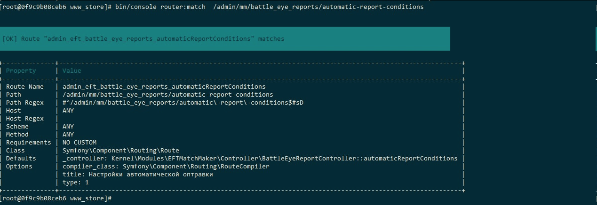

# PHP

## Установка и настройка PHP

Установка php 8

```jsx
sudo apt install apt-transport-https lsb-release ca-certificates wget -y
sudo wget -O /etc/apt/trusted.gpg.d/php.gpg https://packages.sury.org/php/apt.gpg 
sudo sh -c 'echo "deb https://packages.sury.org/php/ $(lsb_release -sc) main" > /etc/apt/sources.list.d/php.list'
sudo apt update
sudo apt install php8.0-common php8.0-cli -y
```

TЕсли не находит release пакета sury

```bash
apt-get update
apt-get -y install apt-transport-https lsb-release ca-certificates curl
curl -sSLo /usr/share/keyrings/deb.sury.org-php.gpg https://packages.sury.org/php/apt.gpg
sh -c 'echo "deb [signed-by=/usr/share/keyrings/deb.sury.org-php.gpg] https://packages.sury.org/php/ $(lsb_release -sc) main" > /etc/apt/sources.list.d/php.list'
apt-get update
```

Установка расширений

```jsx
sudo apt install php7.4-{bz2,curl,intl,mysql,readline,xml}
```

downgrade к 7.4

проверка xml расширения

```jsx
sudo update-alternatives --config php
```

## Установка xml расширения php

```jsx
apt-cache search php | grep xml
```

исходя из той версии, что нам нужна, ставим определенную. Например

```jsx
sudo apt-get install php7.4-xml
```

## RenderController с адаптацией к легаси[(вверх)](PHP.md)

```jsx
namespace Kernel\Modules\VTracker\Controller\Render;

use Kernel\App;
use Kernel\Controller\ControllerRenderAdminTrait;
use Kernel\Page;
use Kernel\View;
use Symfony\Bundle\FrameworkBundle\Controller\Controller;
use Symfony\Component\HttpFoundation\Response;
use VTracker\VTLog;
use Symfony\Component\Routing\Annotation\Route;
 
/**
 * @Route("admin/vtracker", name="vtracker_", defaults={"_module":"VTracker"})
 */
class VTrackerRenderController extends Controller
{
	use ControllerRenderAdminTrait;

	/**
	 * @Route("/{slug}", name="index", options={"type":App::MENU_GLOBAL, "title":"Version Manager"})
	 *
	 * @return Response
	 */
	public function index(string $slug = '')
	{
		$package = App::getContainer()->get('assets.packages');
		View::pageTemplate('legacyPage'); //@see legacyPage.tpl.php
		Page::resetAddons();

		return $this->renderAdmin('
                <div id="VTrackerApp"></div>
                <script type="text/javascript" src="' . $package->getUrl("build/VTracker/vTracker.js") . '"></script>');

	}
}
```

## Прописывание передачи аргумента в роуте[(вверх)](PHP.md)

[https://www.notion.so/PHP-8ce8cb421d7b4fa6887b26eb74c73e64#8c5d326a234f46fc95fae36b859ee9f1](PHP.md)

- Пример метода с передачей аргумента в роуте($botPresetId и $nodeId передается аргументом)
    
    ```php
    /**
    	 * @Route("/{botPresetId<\w+>}/customization/id/{nodeId<\w+>}/chance/edit", name="customization_chance_edit")
    	 * @param $botPresetId
    	 * @param $nodeId
    	 *
    	 * @return Response
    	 */
    	public static function Admin_BotPreset_Customization_Edit($botPresetId, $nodeId)
    	{
    		return new Response(Form::Create('BotGenerator\BotCustomizationNodeEditChance', [
    			'botPresetId' => $botPresetId,
    			'nodeId'      => $nodeId
    		]));
    	}
    ```
    
    на фронте в js файле может быть так
    
    ```php
    $('#content').on('click', 'a.editCustomizationChance', function () {
            ModalForm('Изменить шанс выпадения',
                'admin/eft/bot_generator/botPreset/{botPresetId}/customization/id/{nodeId}/chance/edit',
                this,
                {
                    botPresetId: $(this).attr('data-preset-id'),
                    nodeId: $(this).attr('data-node-id')
                }
            );
            return false;
        });
    ```
    
    ## Рекурсивные функции[(вверх)](PHP.md)
    
    Вот псевдо-код
    
    ```php
    someFunction($array)
    {
      //некоторая логика.
      if (условие для рекурсивного вызова) {
        return $this->someFunction($array-1);
      }
    
      return [];
    }
    ```
    
    суть в том, что не надо передавать по ссылке 
    функция возвращает массив
    массив либо пустой, либо с данными.
    это условия выхода из рекурсии 
    и одно условие для проверки 
    надо ли запускать рекурсивно функцию еще раз. 
    а внутри условного блока ты уменьшаешь массив и передаешь уже только детей. 
    так у тебя распакуется массив
    
    ## Новые правила описания контроллеров для Симфони 4
    
    1. Все контроллеры необходимо наследовать от HttpController или GameController, в зависимости от необходимого формата ответа.
    2. В контроллерах не использовать обращение к getParameter
    3. При рефакторинге контроллеров, необходимо перенеосить его в src/Controller и дальше по структуре. Это позволяет биндить сервисы непосредственно в методы.
    4. При рефакторинге модулей или написании новых, оформляем все в src/. В этой директории настроена автоконфигурация и автовайринг. Описывать классы имеющие единственный вариант реализации нет необходимости. В случае необходимости дописывать новые сервисы в файл services_updated.yml, старые файлы сервисов со временем будут перенесены в автоварйинг/автоконфигурацию.
    
    ## Дебаг роута через консоль
    
    [Routing (Symfony Docs)](https://symfony.com/doc/4.1/routing/debug.html)
    
    
    
    ## Сессии в PHP[(вверх](PHP.md))
    
    Поддержка сессий в PHP заключается в способе сохранения некоторых данных между несколькими последовательными доступами.
    
    Каждому посетителю сайта присваивается уникальный идентификатор, называемый идентификатором сессии (session id). Он хранится либо в cookie на стороне пользователя, либо передаётся через URL.
    
    Поддержка сессий позволяет сохранять данные между запросами в суперглобальном массиве [$_SESSION](https://www.php.net/manual/ru/reserved.variables.session.php). В тот момент, когда посетитель получает доступ к сайту, PHP проверяет автоматически (если [session.auto_start](https://www.php.net/manual/ru/session.configuration.php#ini.session.auto-start) установлено в 1) или по запросу (явным образом через вызов [session_start()](https://www.php.net/manual/ru/function.session-start.php)), был ли определённый идентификатор сессии послан вместе с запросом. Если это так, восстанавливается сохранённое ранее окружение.
    
    **Предостережение**
    
    При включённом [session.auto_start](https://www.php.net/manual/ru/session.configuration.php#ini.session.auto-start) единственным способом помещения объектов в сессию останется загрузка описаний класса с помощью [auto_prepend_file](https://www.php.net/manual/ru/ini.core.php#ini.auto-prepend-file). В противном случае придётся выполнить сериализацию ([serialize()](https://www.php.net/manual/ru/function.serialize.php)) и десериализацию ([unserialize()](https://www.php.net/manual/ru/function.unserialize.php)) объекта вручную.
    
    [$_SESSION](https://www.php.net/manual/ru/reserved.variables.session.php) (и все зарегистрированные переменные) сериализуются внутри PHP после выполнения запроса, используя обработчик сериализации, указанный в INI-опции [session.serialize_handler](https://www.php.net/manual/ru/session.configuration.php#ini.session.serialize-handler). Зарегистрированные, но неопределённые переменные помечаются как неопределённые. При последующем доступе они не определяются сессионным модулем, если пользователь заново не определит их.
    
    **Внимание**
    
    Так как сессионные данные сериализуются, то переменные с типом resource не могут храниться в сессиях.
    
    Обработчики сериализации (`php` и `php_binary`) наследуют ограничения для register_globals. Поэтому нельзя использовать числовые или строковые индексы содержащие специальные символы (`|` и `!`). Их использование приведёт к ошибкам по завершении скрипта. У `php_serialize` такие ограничения отсутствуют.
    
    > Замечание:При работе с сессиями обратите внимание, что запись в сессии не создаётся до тех пор, пока переменная не будет зарегистрирована через функцию session_register() или через добавление нового ключа в суперглобальном массиве $_SESSION. Это правило действует вне зависимости от того, была ли сессия запущена с использованием функции session_start().
    > 
    
    [add a note](https://www.php.net/manual/add-note.php?sect=intro.session&redirect=https://www.php.net/manual/ru/intro.session.php)
    **User Contributed Notes**
    
    There are no user contributed notes for this page.
    

## Web Socket в PHP[(вверх](PHP.md))

- Подробнее
    
    [https://www.notion.so/PHP-8ce8cb421d7b4fa6887b26eb74c73e64#083f114e6ac048079b56c21209ef1a13](PHP.md)
    
    [Делаем вебсокеты на PHP с нуля](https://habr.com/ru/post/209864/)
    
    [WebSockets - полноценный асинхронный веб](https://habr.com/ru/post/79038/)
    
    [Будущее Web это HTML через WebSockets](https://habr.com/ru/post/570522/)
    

## Cache

- OpCache
    
    OPCache — это специальный механизм кэширования, в котором хранятся предварительно скомпилированные версии файлов PHP. При выполнении файл PHP компилируется в байт-код, и после завершения этого процесса байт-код выполняется.
    
    В 99,9% случаев коды операций одни и те же в течение нескольких дней, так как файл может не меняться месяцами, и все же PHP по умолчанию каждый раз перекомпилирует его.
    
    Чтобы улучшить это, приходит OPCache. OPCache повышает производительность PHP, сохраняя предварительно скомпилированный байт-код сценария в общей памяти, устраняя необходимость загрузки и анализа PHP сценариев при каждом запросе.
    
    Начиная с PHP 5.5, он встроен в ядро, и его просто нужно установить, чтобы получить огромное улучшение скорости, поэтому бессмысленно его не использовать.
    
    - Как работает OpCache
        
        ### Как работает оперативный кэш *October 13, 2021*
        
        PHP-расширение opcache реализует различные функции для прозрачного ускорения PHP. Как видно из названия, его происхождение и основная цель — кэширование кода операции, но в настоящее время он также содержит оптимизатор и компилятор точно в срок. Однако этот пост в блоге будет посвящен только аспекту кэширования кода операции.
        
        Opcache имеет три уровня кеша: исходный кеш общей памяти, файловый кеш, представленный в PHP 7, и функциональность предварительной загрузки, добавленная в PHP 7.4. Мы обсудим все это по очереди.
        
        Хотя opcache номинально является независимым расширением, его функциональность сильно зависит от деталей реализации движка, а модификации движка часто требуют изменений и в opcache. Таким образом, способ работы opcache значительно различается в разных версиях PHP. В этой статье описывается состояние PHP 8.1 и освещаются некоторые изменения в этой версии.
        
        # Общая память
        
        Основная цель opcache — кэшировать артефакты компиляции в разделяемой памяти, чтобы избежать необходимости перекомпилировать PHP-скрипты при каждом выполнении.
        
        В Unix-подобных системах при запуске выделяется один сегмент общей памяти фиксированного размера (SHM). Для обработки запросов PHP либо разветвляет дополнительные процессы, либо порождает дополнительные потоки. Эти процессы/потоки будут видеть сегмент SHM по тому же адресу.
        
        Поскольку Windows не поддерживает разветвление, обычно вместо этого создаются полностью отдельные процессы PHP, у которых нет общего адресного пространства. Это большая проблема для opcache, потому что он требует, чтобы сегмент SHM отображался по одному и тому же адресу в каждом процессе. В противном случае указатели на SHM недействительны для разных процессов.
        
        Чтобы это работало, opcache сохраняет базовый адрес SHM и пытается отобразить сегмент по тому же адресу в других процессах. Если это не удается, opcache возвращается к использованию файлового кеша. Однако даже в случае успеха существуют ограничения: хотя это гарантирует одинаковый адрес для сегмента SHM, адреса внутренних функций/классов могут различаться между процессами из-за ASLR. Это означает, что в Windows кэшированные артефакты не могут зависеть от внутренних функций/классов и т. д.
        
        Windows — единственная платформа, на которой два несвязанных процесса PHP могут совместно использовать один и тот же SHM opcache. Например, два одновременных вызова CLI могут совместно использовать один и тот же кэш, что невозможно в других операционных системах. В `opcache.cache_id`этом случае существует настройка для принудительного использования другого кэша.
        
        Поскольку поддерживать отдельное поведение для Windows довольно сложно, opcache может отказаться от поддержки повторного присоединения от несвязанных процессов в будущем, а это означает, что в Windows потребуется использование SAPI на основе потоков, а не на основе процессов.
        
        # Блокировка и неизменность
        
        Когда используется общая память, всегда важно учитывать модель доступа. Поскольку мы не хотим выполнять какие-либо мелкие операции блокировки или атомарный подсчет ссылок во время выполнения, модель памяти opcache оказывается очень простой: разделяемая память неизменяема.
        
        По сути, Opcache имеет только две блокировки: одна — блокировка записи, которую может удерживать только один процесс, которому разрешено изменять SHM. Пока блокировка записи удерживается, другим процессам по-прежнему разрешено читать SHM. Таким образом, удержание блокировки записи обычно позволяет вам только выделять новую память в сегменте SHM и записывать в нее, но не изменять уже выделенную и потенциально используемую общую память (за некоторыми исключениями).
        
        Этот `opcache.protect_memory`параметр можно использовать для защиты всего сегмента SHM всякий раз, когда блокировка записи не удерживается, что полезно для обнаружения нарушений инварианта неизменности (но его не следует включать в рабочей среде по соображениям производительности).
        
        Другая блокировка — это блокировка чтения, которая устанавливается, когда запрос использует SHM в первый раз. Он не отслеживает, что используется и перестает ли использоваться. Единственная цель — записать, что кеш каким- *то образом* используется в этом запросе.
        
        Целью этой блокировки является облегчение перезапуска операционного кеша: поскольку мы не отслеживаем, какие части кеша используются детально, невозможно удалить что-либо из кеша кода операции. Когда кеш заполняется, вместо этого планируется перезапуск.
        
        Если запланирован перезапуск, вновь запущенные запросы не будут использовать кеш SHM (но могут вернуться к файловому кешу). Когда количество пользователей падает до нуля, весь кеш очищается и мы можем начать с нуля. Если количество пользователей не упадет до нуля в течение `opcache.force_restart_timeout`, то opcache убьет оставшихся пользователей.
        
        # Указатели карты
        
        Некоторые из структур, хранящихся в кэше SHM, нуждаются (или, по крайней мере, хотят) ссылаться на данные для каждого запроса. Например, хотя определение функции обычно неизменяемо, оно может содержать статические переменные, которые будут разными для каждого запроса. Точно так же функции используют кэш времени выполнения для кэширования разрешений символов, специфичных для запроса.
        
        Поскольку мы не можем хранить информацию о каждом запросе в неизменяемом кеше общей памяти, вместо этого мы используем косвенность «указатель карты». Вместо того, чтобы хранить указатель на статические переменные, мы храним ссылку на то, где будут храниться статические переменные.
        
        В текущей реализации указатель карты принимает одну из двух форм: либо это простой указатель на фактическое хранилище указателя, который представляет собой представление, используемое, когда структура не кэшируется в SHM. Указатель косвенности обычно размещается на арене.
        
        В качестве альтернативы указатель карты хранит только смещение от базового адреса, где базовый адрес будет отличаться для каждого запроса. Это представление используется для неизменяемых структур в разделяемой памяти. Мы отслеживаем, насколько большой должна быть используемая область указателя карты, и обнуляем ее при каждом запросе.
        
        ```php
        For mutable memory: map_ptr & 1 == 0
        
        map pointer ----> indirection pointer -----> static variables
                          (arena allocated)
        
        For immutable memory: map_ptr & 1 == 1
        
        map base pointer: slot 0
                          slot 1
            + map offset: slot 2 -----> static variables
                          slot 3
        
        ```
        

Хотя ясно, почему нам нужна косвенность во втором случае (отдельная область указателя карты для каждого запроса), можно задаться вопросом, какова цель косвенного указателя в первом случае: поскольку память изменяема, мы могли бы хранить статические переменные указатель напрямую. Это действительно исторический артефакт, и ненужная косвенность, скорее всего, исчезнет в PHP 8.2.

# Интернированные строки

На этом этапе давайте отвлечемся на обсуждение интернированных строк. Строки в PHP представлены в виде структуры с подсчетом ссылок, в которой хранится длина строки, ее содержимое и ее хэш. Хотя строки могут быть общими, также может быть несколько строк с одинаковым содержимым, если они создаются независимо.

Интернированные строки дедуплицируются: будет только одна интернированная строка с заданным содержимым. Это экономит память и может сделать сравнение более эффективным, потому что более вероятно срабатывание быстрого пути равенства указателей. Интернированные строки в PHP также неизменяемы из-за отсутствия подсчета ссылок.

Без opcache PHP разделяет интернированные строки на постоянные и для каждого запроса. Постоянные интернированные строки создаются во время запуска, например, для имен внутренних классов/функций. Строки для каждого запроса создаются для символов и литералов в сценариях PHP (если для них еще не существует постоянной интернированной строки) и отбрасываются в конце запроса.

Когда opcache включен, интернированные строки хранятся в SHM, поэтому они дедуплицируются между процессами, и на них могут ссылаться структуры, кэшированные в SHM. При запуске opcache будет копировать постоянные интернированные строки в SHM по мере возможности (он может не знать обо всех указателях, которые где-то хранятся), но это не важно для корректности.

Кроме того, создание интернированных строк во время запроса отключено. Вместо этого создаются обычные неинтернированные строки. Только когда скомпилированный сценарий кэшируется (и устанавливается блокировка записи SHM), строки преобразуются в интернированные строки SHM.

# Кэш записей класса

PHP-скрипты содержат много ссылок на классы в строковой форме, например, `new Foo`или `Foo $param`типа. Поскольку фактическая идентификация `Foo`может различаться между запросами, невозможно скомпилировать их до прямой ссылки на класс.

Извлечение записи класса из имени класса относительно дорого для того, насколько оно распространено: нам нужно преобразовать строку в нижний регистр и найти ее в хэш-таблице класса. Для ссылок, подобных `new Foo`этому, поиск кэшируется в кэше времени выполнения функции. Однако не всегда возможно использовать кеш времени выполнения. Например, проверки типов свойств не могут использовать кеш времени выполнения, а до версии PHP 8.1 вместо имени строки использовалась запись класса непосредственно внутри типа, что означает, что тип не может жить в SHM.

PHP 8.1 представил кэш записей классов, который объединяет интернированные строки с указателями карты. Для интернированных строк, используемых в определенных позициях (объявления классов и имена типов), выделяется слот указателя карты, в котором хранится разрешенная запись класса для этого имени. Чтобы избежать увеличения размера строки, используется трюк:

Обычно интернированные строки всегда имеют счетчик ссылок, равный 2. Однако фактический счетчик ссылок не имеет значения, он должен быть больше 1, чтобы обеспечить дублирование строки при модификации. Строки с refcount 1 могут быть изменены на месте. Таким образом, мы можем использовать поле refcount для хранения смещения указателя карты для использования в качестве кэша записей класса.

У этого есть некоторые ограничения, потому что он привязан к механизму интернированных строк. Например, если opcache включен, но скрипт не кэширован, то интернированные строки не будут использоваться и, следовательно, кэш записей класса будет недоступен.

Одна из приятных особенностей кеша записей классов заключается в том, что он довольно общий и не привязан к конкретным языковым конструкциям (например, кешу времени выполнения). Если вы пишете `new ReflectionClass(Foo::class)`, поиск класса может быть кэширован, даже если это происходит динамически.

# Сопротивляться

Фактическое сохранение сценариев в разделяемой памяти относительно просто. Скрипт сначала компилируется как обычно, за исключением некоторых опций, позволяющих убедиться, что во время компиляции не используются межфайловые зависимости. Результат компиляции перемещается из глобальных таблиц функций/классов в автономную постоянную структуру сценария.

Затем вычисляется размер требуемого сегмента разделяемой памяти. Этот шаг должен точно отражать логику фактического шага сохранения, но (в основном) не изменяет скрипт. Если выделение разделяемой памяти не удается, мы все равно можем обойти opcache и выполнить его как обычно. Единственная модификация, которую делает шаг «persist calc», — это преобразование строк в интернированные строки SHM, если это возможно, поскольку интернированные строки хранятся в сегменте фиксированного размера, который отделен от сохраняемого скрипта. Строки, которые успешно интернированы, не учитываются при расчете размера скрипта.

Наконец, на этапе сохранения сценарий копируется в общую память и освобождается исходный сценарий. Для этого он отслеживает таблицу xlat, которая сопоставляет исходные указатели с новыми указателями в разделяемой памяти. Это позволяет разрешать повторное использование одного и того же указателя.

# Кэш наследования

Внутренние занятия бывают двух видов. Несвязанные классы представляют собой объявление класса в том виде, в каком вы написали бы его в коде: он содержит методы, объявленные в этом классе, и ссылается на зависимости (родительский класс, интерфейсы, трейты) в виде строк. Связанные классы представляют собой объявление класса, для которого успешно завершено наследование. Он содержит унаследованные методы/свойства/и т. д. и ссылается на зависимости как на разрешенные записи класса.

При рассмотрении одного скрипта классы обычно существуют в несвязанной форме (если только они не имеют зависимостей). Связывание классов требует просмотра классов в других файлах. Однако используемое объявление класса может отличаться от одного запроса к другому.

До PHP 8.1 это означало, что кэшировался только несвязанный шаблон класса, и наследование по-прежнему должно выполняться для каждого запроса. Поскольку наследование — довольно дорогостоящий процесс, это оказало нетривиальное влияние на производительность. В PHP 8.1 это решается введением кеша наследования.

Кэш наследования хранит связанный результат наследования для заданного набора зависимостей. Когда во время выполнения запрашивается наследование, зависимости имени класса разрешаются в записи класса, и если запись кэша для этого набора зависимостей уже существует, она используется. Хотя зависимости *могут* различаться между запросами, на практике они обычно будут одинаковыми, поэтому наследование необходимо выполнить только один раз.

Если записи в кэше нет, несвязанный класс копируется из SHM в изменяемую память для каждого процесса, и для него выполняется процесс наследования (на месте). Результат сохраняется в кэше наследования с использованием, по сути, обычного процесса сохранения вместе с зависимостями, для которых эта запись в кэше действительна.

# Предварительная загрузка

Предварительная загрузка — более радикальное решение проблемы наследования: все, что загружено сценарием предварительной загрузки, будет сохраняться между запросами. Таким образом, в этом случае безопасно использовать зависимости между сценариями. Недостатком является то, что состояние предварительной загрузки нельзя изменить без перезапуска PHP.

Некоторые преимущества предварительной загрузки, вероятно, устарели из-за кеша наследования в PHP 8.1, хотя предварительная загрузка все еще имеет некоторые преимущества: классы доступны в полностью наследуемой форме в начале запроса. Единственная стоимость предварительной загрузки в расчете на запрос — это очистка области указателя карты. Обычное использование opcache по-прежнему требует автозагрузки, поиска постоянных сценариев, регистрации записей в глобальных хеш-таблицах, поиска и проверки зависимостей для кеша наследования и т. д.

Предварительная загрузка может работать в двух режимах: когда классы просто загружаются с помощью `require`, наследование происходит, как обычно, и предварительная загрузка может поддерживать классы с произвольно сложными сценариями наследования (включая циклы отклонений). Это также упрощает обеспечение того, чтобы все необходимые зависимости были предоставлены автозагрузчиком.

Кроме того, можно предварительно загрузить файлы с расширением `opcache_compile_file()`. В этом случае opcache попытается предварительно загрузить класс, если все зависимости для него также доступны. В противном случае он выдаст предупреждение и кэширует скрипт по старинке. До PHP 8.1 требование «все зависимости» было довольно проблематичным.

В более ранних версиях PHP несвязанные классы сохранялись в двух частях: одна фактически неизменяемая, а другая должна была быть скопирована в память для каждого запроса, поскольку она может быть изменена во время выполнения. Сюда входят типы свойств, а также инициализаторы констант/свойств. Если они не могут быть полностью разрешены во время предварительной загрузки, класс не может быть предварительно загружен, потому что в этом случае мы не можем выполнять копии для каждого запроса. В PHP 8.1 все оставшиеся части, изменяемые во время выполнения, были переключены на указатели карты, тем самым ослабив ограничение на то, что считается «зависимостью». Теперь сюда входят только родители/интерфейсы/черты, а также типы, необходимые для выполнения проверок дисперсии.

Еще одна проблема — проверка дисперсии: очень сложно заранее определить, требуется ли тип аргумента/возврата для выполнения проверки дисперсии. Это зависит от того, является ли метод на самом деле переопределением (что неочевидно при наличии трейтов) и можно ли определить отношение подтипа без загрузки класса (например, если типы в родительском и дочернем методе точно такие же). . Предыдущие версии PHP решали эту проблему эвристически, требуя больше зависимостей, чем необходимо. Вместо этого PHP 8.1 просто пытается наследовать копию класса и отбрасывает ее в случае неудачи.

Это означает, что `opcache_compile_file()`предварительная загрузка на основе должна быть намного более предсказуемой в PHP 8.1.

# Файловый кеш

Файловый кеш, представленный в PHP 7, можно использовать либо автономно ( `opcache.file_cache_only`), либо в сочетании с SHM-кэшем в качестве кеша второго уровня. В последнем случае он будет использоваться при холодном запуске или когда кэш SHM недоступен во время перезапуска opcache. В Windows резервное копирование файлового кэша включено по умолчанию, чтобы обеспечить доступность хотя бы некоторого кэширования в случае сбоя повторного подключения SHM.

Сериализация файлового кэша начинается с постоянного представления сценария либо в SHM (второй уровень), либо во временной области памяти (автономный), но созданного с использованием обычного механизма сохранения. Фактическая сериализация затем заменяет все указатели смещениями в область памяти («раскручивание указателя»). Это обеспечивает эффективную десериализацию путем добавления нового базового указателя ко всем указателям.

Основной сложностью в этой модели являются интернированные строки, поскольку это единственные указатели, не указывающие на область постоянной памяти. Интернированные строки, на которые ссылаются, вместо этого сериализуются в отдельную область памяти. При десериализации делается попытка преобразовать их обратно в интернированные строки SHM.

Десериализация работает путем копирования содержимого файла (включая сериализованный сценарий и область интернированных строк) в буфер. В автономном режиме этот буфер не является временным, и десериализация (прокрутка указателя) происходит непосредственно в этом буфере.

В режиме второго уровня этот буфер обычно является временным. Вместо этого выполняется распределение SHM, в которое копируется сериализованный сценарий и где он не сериализуется. В этом случае все интернированные строки также необходимо преобразовать в интернированные строки SHM. Затем временный буфер можно удалить. Однако, если не все интернированные строки могут быть вставлены из-за переполнения буфера интернированных строк, тогда сегмент SHM отбрасывается и выполняется десериализация для каждого запроса, как в автономном случае.

[How opcache works](https://www.npopov.com/2021/10/13/How-opcache-works.html)

## array_reduce[(вверх)](PHP.md)

- Подробнее
    
    ```php
    array_reduce($items, static function($carry, $item) {
    				//операции с $carry
    				return $carry;
    			},
    			$startCarryValue
    		);
    $items итерируемый массив
    $carry агрегирующая переменная
    $startCarryValue начальное значение агрегирующей переменной
    ```
    
    Пример
    
    ```php
    $dupeItems = array_reduce(
    			$items,
    			static function($carry, $item) {
    				$carry .= ($item['isHighlightItem'] ? "\u{00002757} " : "") . "{$item['name']} {$item['count']} шт.\n";
    
    				return $carry;
    			},
    			''
    		);
    ```
    

## SWOOLE

[Swoole ускоряем php в десятки раз, асинхронный php](https://www.youtube.com/watch?v=0T7-trF794w)

## Garbage Collector(сборщик мусора)

[Сборка мусора](https://www.php.net/manual/ru/features.gc.php)

[PHP: SplFixedArray - Manual](https://www.php.net/manual/ru/class.splfixedarray.php)

## Shell PHP в командной строке

в командной строке ввести

```php
php -a
```


Если надо подтянуть файл с переменными

test.php

```sql
<?php

$test = [
    "method" => "agent.set_metrics",
    "params" => [
        "total_ram_usage" => 10000000000,
        "total_cpu_usage" => 20,
        "current_time"    => 1685097409,
        "rooms"           => [
            [
                "process_id" => 1,
                "start_time" => 1685097409,
                "cpu_usage"  => 11,
                "ram_usage"  => 22
            ]
        ]
    ],
    "id"     => "641c4fc67da0c14a87072a59"
];

```

```sql
require_once 'test.php';
echo strlen(json_encode($test));
```

```sql
231
```