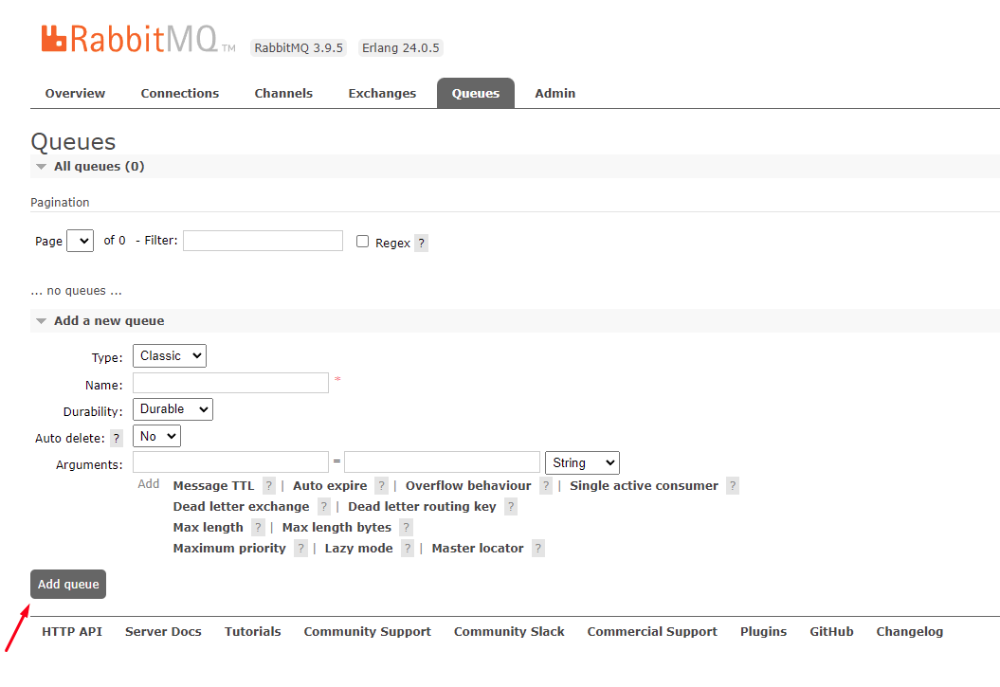

# Rabbit

- Как создать пустую очередь, чтобы смотреть там сообщения

### Как создать пустую очередь, чтобы смотреть там сообщения

- Подробнее
    
    Создаешь пустую очередь для наблюдения
    
    
    
    Открываешь оригинальную очередь
    
    Смотришь ее биндинги
    
    
    
    Заходишь в свою
    
    
    
    биндишь очередь к exchange и routing_key и все эвенты в exchange с таким routing_key будут попадать туда
    
    Ниже находишь Publish message и потом get messages